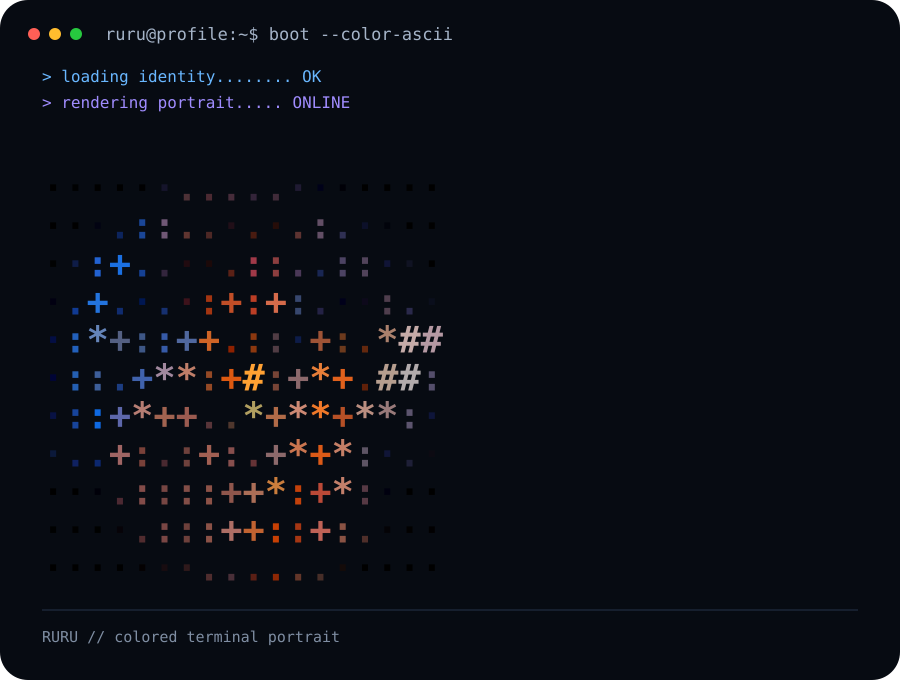
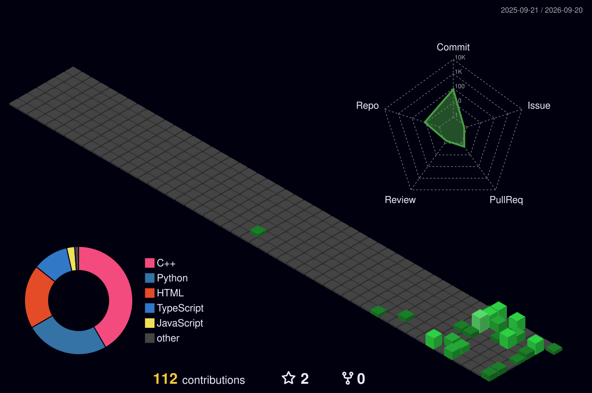

<div align="center">

<p align="center">
  <code>RURU // ENGINEERING LAB</code>
</p>

<br>

<a href="https://github.com/akaKRISH">
  
</a>

<br><br>

# RURU

### Engineering Student · AI Builder · Systems Thinker

<p align="center">
  <em>Building intelligent systems, learning deeply, and turning experiments into useful software.</em>
</p>

<br>

<p align="center">
  <a href="https://github.com/akaKRISH"></a>
  &nbsp;
  <a href="https://github.com/akaKRISH/GestureOS"></a>
  &nbsp;
  <a href="https://github.com/akaKRISH/ruru-portfolio"></a>
  &nbsp;
  <a href="https://akakrish.github.io/akaKRISH/interactive/"></a>
</p>

</div>

<br><br>

---

<br>

## /about

I am an engineering student focused on **intelligent interfaces, software systems, computer vision, and applied AI**.

I learn through intentional building: creating prototypes, developer tools, spatial interaction systems, and experiments that force me to understand how computing systems operate from first principles.

> **Learn deeply. Build boldly. Think beyond the obvious.**

<br><br>

---

<br>

## /currently-building

```text
01  GESTURE OS
    Touchless spatial computing · Real-time perception · Desktop interaction

02  RURU OS
    AI-native personal engineering OS · Automation · Knowledge systems

03  RURU PROTOCOL
    Interactive 3D developer portfolio · Three.js · Custom shaders

04  ENGINEERING FOUNDATIONS
    Data Structures & Algorithms · Python · Java · C++ · Systems design
```

<br><br>

---

<br>

## /flagship — Gesture OS

<div align="center">

```text
========================================================================
  GESTURE OS  //  TOUCHLESS SPATIAL COMPUTING PLATFORM
========================================================================
```

</div>

**GestureOS** transforms standard webcam feeds into a responsive, touchless desktop interaction layer. Built with on-device computer vision and low-latency event dispatching, it enables spatial navigation without proprietary hardware.

### 📐 Perception & Architecture
* **Perception Layer:** 21 3D Hand Landmarks, 468 Face Mesh Points, 6-DoF Head Pose estimation via PnP, and 1€ Temporal Jitter Filtering.
* **Multimodal Fusion:** Real-time geometric and dynamic classification with velocity vectors and pinch metrics.
* **Safety State Machine:** Face-presence verification, dwell-time confirmation, and fail-safe emergency disengage triggers.
* **Dispatch Engine:** Native OS input injection (Mouse/Keyboard), HUD overlay system, and sandboxed plugin architecture.

### ⚡ Core Capabilities
* **25+ Gesture Vocabulary:** Precision pointing, pinch-drag, inertial scroll, window management, media controls, and macro triggers.
* **AirMouse:** Inertial cursor control with dynamic sensitivity damping for pixel-accurate targeting.
* **Privacy-First:** 100% on-device vision inference — zero video frames or telemetry leave the local machine.
* **Extensibility:** Built-in Gesture Studio, plugin SDK, and full developer packaging pipeline.

<br>

<div align="center">

👉 [**Explore the GestureOS Repository & Architecture on GitHub →**](https://github.com/akaKRISH/GestureOS)

</div>

<br><br>

---

<br>

## /selected-work

* **[GestureOS](https://github.com/akaKRISH/GestureOS)** — *(Flagship)* Touchless desktop automation, computer vision perception, and 3D spatial UI.
* **[RuruOS](https://github.com/akaKRISH/RuruOS)** — AI-native personal engineering environment for automation, research, and developer workflows.
* **[ruru-protocol](https://github.com/akaKRISH/ruru-protocol)** — Cinematic developer portfolio powered by React, Three.js, and custom shader engines.
* **[Groundwater Prediction System](https://github.com/akaKRISH/GROUNDWATER_PREDICITION_SYSTEM)** — Environmental data modeling and machine learning prediction pipeline.
* **[Agent Evaluator Hackathon](https://github.com/akaKRISH/agent-evaluator-hackathon)** — Autonomous AI agent evaluation benchmark and test framework.
* **[LeetCode Practice](https://github.com/akaKRISH/LeetCode)** — Algorithmic problem solving, data structures, and computational optimization in C++.

<br><br>

---

<br>

## /stack

**Languages**<br>
`Python` · `Java` · `C++` · `JavaScript` · `TypeScript` · `HTML/CSS`

<br>

**AI & Computer Vision**<br>
`OpenCV` · `MediaPipe` · `LLMs & AI Agents` · `PyTorch` · `Scikit-Learn`

<br>

**Systems & Web**<br>
`React` · `Three.js` · `Qt / PySide6` · `Git` · `GitHub Actions` · `Linux` · `Docker`

<br>

**Current Depth-Building**<br>
`DSA` · `Java Core` · `Low-Level Optimization` · `Agentic Architectures` · `Systems Design`

<br><br>

---

<br>

## /activity

<div align="center">

<a href="https://github.com/akaKRISH">
  
</a>

</div>

<br><br>

---

<br>

## /3d-contribution-field

<div align="center">

<p><em>A visual topological map of engineering activity and commits.</em></p>

<br>

<a href="https://akakrish.github.io/akaKRISH/interactive/">
  
</a>

<br><br>

<a href="https://akakrish.github.io/akaKRISH/interactive/">
  
</a>

<p><sub>Click to launch interactive 3D rotation, tilt, and zoom in the browser</sub></p>

</div>

<br><br>

---

<br>

## /contribution-trajectory

<div align="center">

<picture>
  <source media="(prefers-color-scheme: dark)" srcset="assets/snake/github-contribution-grid-snake-dark.svg">
  <source media="(prefers-color-scheme: light)" srcset="assets/snake/github-contribution-grid-snake.svg">
  
</picture>

</div>

<br><br>

---

<div align="center">

<br>

[GitHub](https://github.com/akaKRISH) &nbsp;·&nbsp; [GestureOS](https://github.com/akaKRISH/GestureOS) &nbsp;·&nbsp; [RuruOS](https://github.com/akaKRISH/RuruOS) &nbsp;·&nbsp; [Portfolio](https://github.com/akaKRISH/ruru-portfolio) &nbsp;·&nbsp; [Interactive Lab](https://akakrish.github.io/akaKRISH/interactive/)

<br><br>

<code>RURU // building intelligent systems one layer at a time.</code>

<br><br>

</div>
