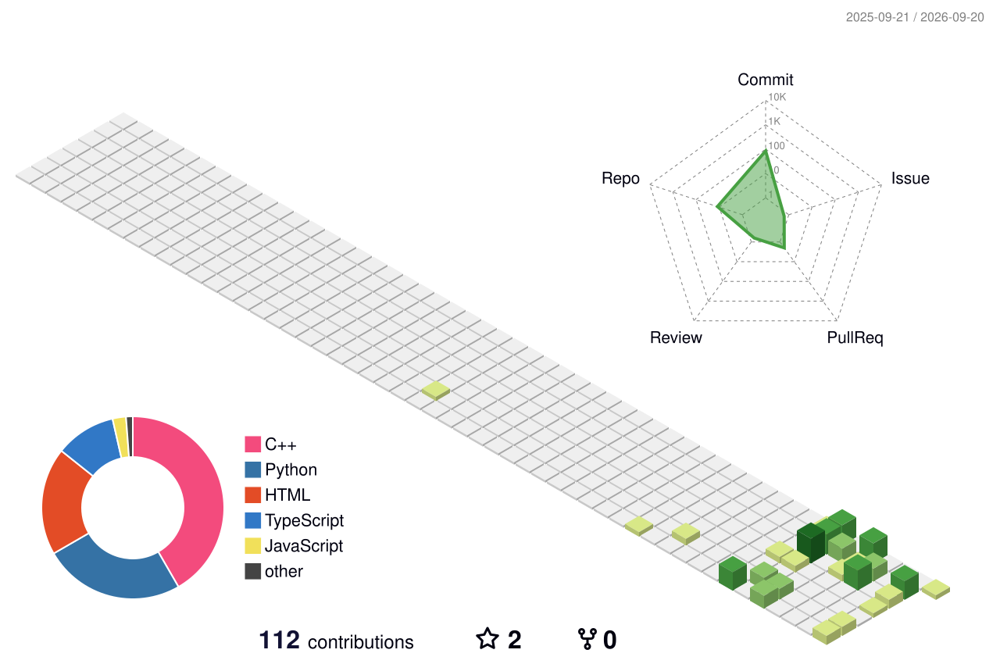

<div align="center">

```text
> booting RURU...
> loading identity...
> rendering profile...
> system online
```

```text
,,,,,,,,,,,,,,,,,,,,,,,,,,,,,,,,,,,,,,,,,,,,,
,,,,,,,,,,,,,,,,,,,,,,,,,,,,,,,,,,,,,,,,,,,,,
,,,,;;;;;;;,,,,,,,,;;;;;;;,,,,,,,,;;;;;;;,,,,
,,,,;;;;;;;,,,,,,,,;;;;;;;,,,,,,,,;;;;;;;,,,,
,,,,;;;;;;;,,,,,,,,;;;;;;;,,,,,,,,;;;;;;;,,,,
,,,,;;;;;;;::::::::;;;;;;;::::::::;;;;;;;,,,,
,,,,,,,,,,,;;;;;;;;,,,,,,,;;;;;;;;,,,,,,,,,,,
,,,,,,,,,,,;;;;;;;;,,,,,,,;;;;;;;;,,,,,,,,,,,
,,,,,,,,,,,;;;;;;;;,,,,,,,;;;;;;;;,,,,,,,,,,,
,,,,,,,,,,,,,,,,,,,,,,,,,,,,,,,,,,,,,,,,,,,,,
,,,,,,,,,,,,,,,,,,,,,,,,,,,,,,,,,,,,,,,,,,,,,
,,,,,,,,,,,,,,,,,,,,,,,,,,,,,,,,,,,,,,,,,,,,,
,,,,,,,,,,,,,,,,,,,,,,,,,,,,,,,,,,,,,,,,,,,,,
,,,,;;;;;;;;;;;;;;;;;;;;;;;;;;;;;;;;;;;;;,,,,
,,,,;;;;;;;;;;;;;;;;;;;;;;;;;;;;;;;;;;;;;,,,,
,,,,;;;;;;;;;;;;;;;;;;;;;;;;;;;;;;;;;;;;;,,,,
,,,,;;;;;;;;;;;;;;;;;;;;;;;;;;;;;;;;;;;;;,,,,
,,,,,,,,,,,;;;;;;;;;;;;;;;;;;;;;;;,,,,,,,,,,,
,,,,,,,,,,,;;;;;;;;;;;;;;;;;;;;;;;,,,,,,,,,,,
,,,,,,,,,,,;;;;;;;;;;;;;;;;;;;;;;;,,,,,,,,,,,
,,,,,,,,,,,,,,,,,,,,,,,,,,,,,,,,,,,,,,,,,,,,,
,,,,,,,,,,,,,,,,,,,,,,,,,,,,,,,,,,,,,,,,,,,,,
```

# RURU
**Engineering Student · AI Builder · Systems Thinker**

*Building intelligent systems, learning deeply, and turning experiments into useful software.*

<br>

[](#)
[](#)
[](https://github.com/akaKRISH/ruru-protocol)

</div>

---

### 📡 CURRENTLY BUILDING

**01 — [Gesture OS](https://github.com/akaKRISH/GestureOS)**  
Privacy-first, AI-powered spatial computing platform. Using computer vision to control your desktop with fluid hand gestures. *(100% on-device vision inference)*

**02 — [RuruOS](https://github.com/akaKRISH/RuruOS)**  
AI-native Personal Engineering Operating System for Software Engineering, Automation, and Research.

**03 — [ruru-protocol](https://github.com/akaKRISH/ruru-protocol)**  
An immersive interactive 3D developer portfolio. Built with React, Three.js, and custom shaders.

**04 — Developer Foundations**  
Deep-diving into Data Structures & Algorithms, Java, C++, and Intelligent Interfaces.

---

### 🛠️ STACK & SYSTEMS

**Languages**  
`Python` `TypeScript` `JavaScript` `C++` `Java` `HTML/CSS`

**AI & Intelligent Systems**  
`OpenCV` `MediaPipe` `LLMs` `AI Agents` `PyTorch` 

**Architecture & Tools**  
`Git` `Docker` `GitHub Actions` `Linux` `Three.js` `React`

---

### 📊 ACTIVITY

<div align="center">
  <picture>
    <source media="(prefers-color-scheme: dark)" srcset="assets/snake/github-contribution-grid-snake-dark.svg">
    <source media="(prefers-color-scheme: light)" srcset="assets/snake/github-contribution-grid-snake.svg">
    
  </picture>
</div>

---

### 🌌 3D CONTRIBUTIONS

<div align="center">
  
</div>

---
<div align="center">
  <i>Learn deeply. Build boldly. Think beyond the obvious.</i>
</div>
